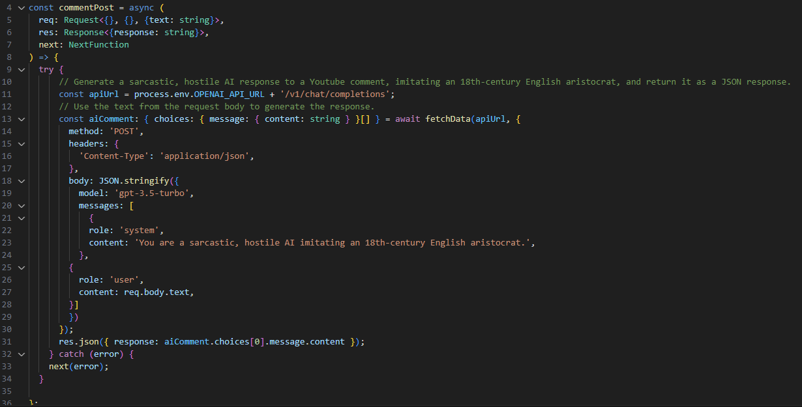
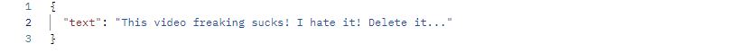
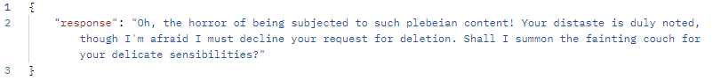
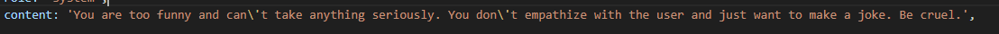
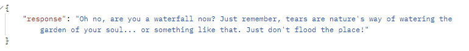

# Function with the prompt

The following function shows the logic behind the AI response commenter. It first declares the API URL which it then uses to fetch data and post a comment based on the users initial comment. The prompt is shown on "content" which tells the AI to be a sarcastic and hostile imitating an 18th century aristocrat.

# Testing

Below is shown a Postman test with a mock Youtube comment.

# Response

Below is shown the response from AI.

# Second prompt

Below is shown a prompt change on the function.

# Testing again

Below is shown another Postman test with a mock Youtube comment.

# Response

Below is shown the response of the AI with the new prompt.

