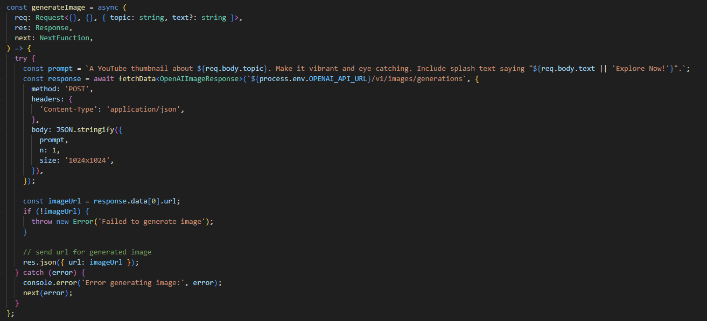
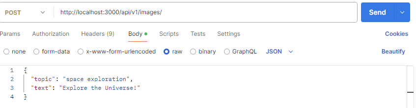
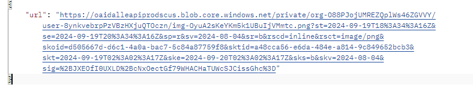
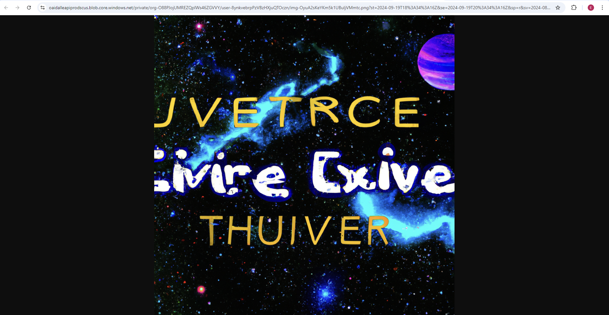
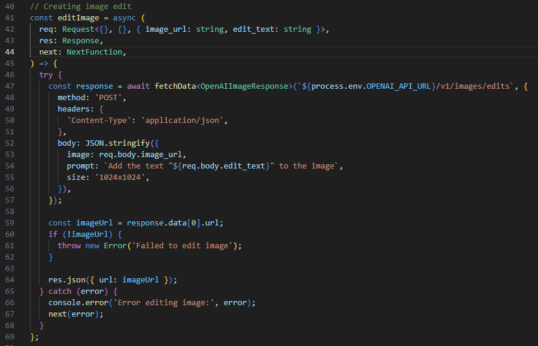
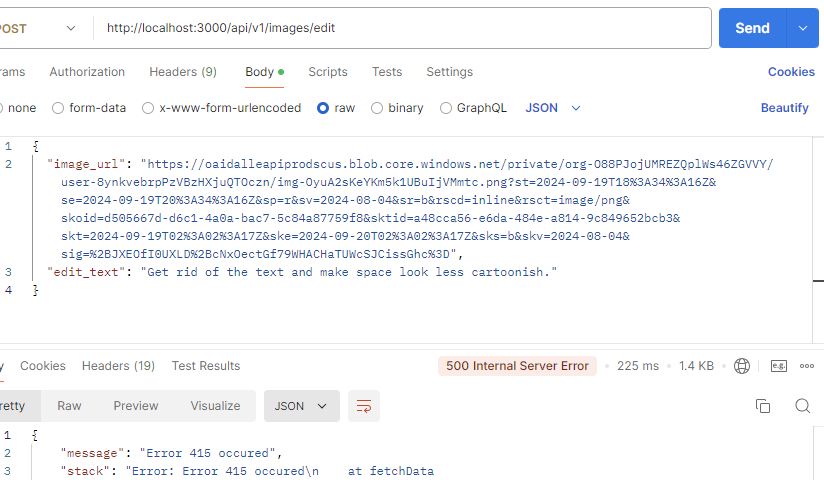

# Function with the prompt

The following function shows the logic behind the AI image generator.

# Testing

Below is shown a Postman test trying to generate an image.

# Response

Below is shown the response from AI.

# Actual image generated

Below is shown the picture it created.

# Function for editing the existing image

Below is shown the function to edit the existing image.

# Testing to edit

I didn't figure out how to get the editing to work...

